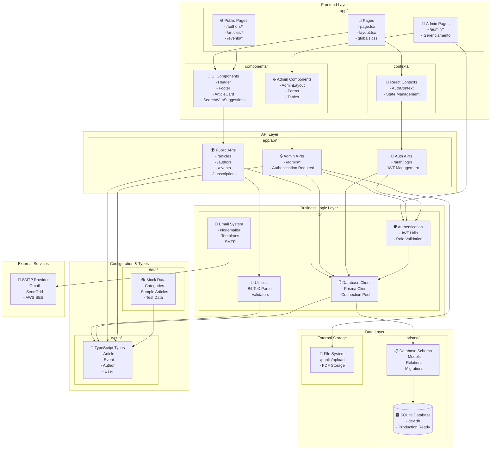
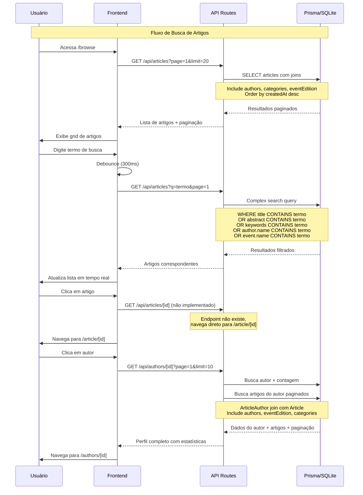

# Diagramas UML - Sistema Artigador

Este documento contém dois diagramas UML do sistema Artigador. Um diagrama de sequência e um diagrama de pacote

## Diagrama de Pacotes - Arquitetura do Sistema

Este diagrama mostra a organização dos principais pacotes e suas dependências no sistema.

## Diagrama de Sequência - Busca e Navegação de Artigos

Este diagrama mostra o fluxo de busca e navegação de artigos por usuários.

