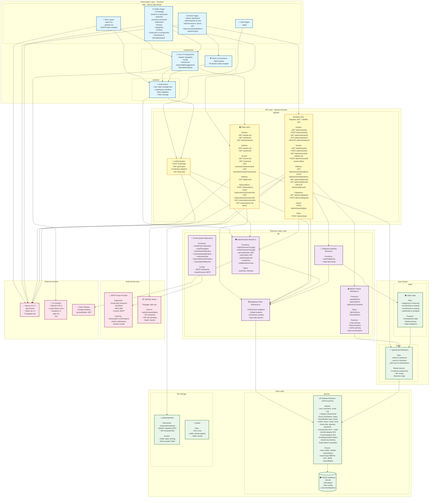

# Diagramas UML - Sistema Artigador

Este documento contém dois diagramas UML do sistema Artigador. Um diagrama de sequência e um diagrama de pacote

## Diagrama de Pacotes - Arquitetura do Sistema

Este diagrama mostra a organização dos principais pacotes e suas dependências no sistema.

## Diagrama de Sequência - Importação em Massa de Artigos (BibTeX + ZIP)

Este diagrama mostra o fluxo completo de importação em massa de artigos a partir de arquivos BibTeX e ZIP com PDFs.

```mermaid
sequenceDiagram
    participant Admin as Administrador
    participant UI as Frontend<br/>/admin/import
    participant API as API Route<br/>/api/admin/import/bibtex
    participant Parser as BibTeX Parser<br/>lib/bibtex.ts
    participant Zip as AdmZip<br/>Processor
    participant FS as File System<br/>public/uploads
    participant DB as Prisma/SQLite

    Note over Admin,DB: Fluxo de Importação em Massa

    Admin->>UI: Acessa /admin/import
    UI->>API: GET /api/admin/events
    API->>DB: SELECT events com editions
    DB-->>API: Lista de eventos
    API-->>UI: Eventos disponíveis
    UI->>API: GET /api/admin/categories
    API->>DB: SELECT categories
    DB-->>API: Lista de categorias
    API-->>UI: Categorias disponíveis
    UI-->>Admin: Exibe formulário

    Admin->>UI: Seleciona Event & Edition
    Admin->>UI: Marca Default Categories
    Admin->>UI: Upload arquivo .bib
    UI->>UI: Lê conteúdo do arquivo
    UI-->>Admin: Preview no textarea
    
    Admin->>UI: Upload arquivo .zip (PDFs)
    UI->>UI: Armazena arquivo ZIP
    UI-->>Admin: Confirma arquivo carregado

    Admin->>UI: Clica "Import Articles"
    UI->>UI: Cria FormData
    Note over UI: FormData contém:<br/>- bibtexFile<br/>- pdfZip<br/>- eventEditionId<br/>- defaultCategories

    UI->>API: POST multipart/form-data
    
    API->>API: Verifica autenticação JWT
    alt Token inválido
        API-->>UI: 401 Unauthorized
        UI-->>Admin: Erro de autenticação
    else Token válido mas não é ADMIN
        API-->>UI: 403 Forbidden
        UI-->>Admin: Acesso negado
    end

    API->>API: Extrai FormData
    API->>API: Lê bibtexFile.text()
    
    API->>Parser: parseBibTeX(content)
    Parser->>Parser: Remove comentários
    Parser->>Parser: Regex para @inproceedings
    Parser->>Parser: Extrai campos (author, title, etc)
    
    alt BibTeX inválido
        Parser-->>API: throw Error
        API-->>UI: 400 Invalid BibTeX format
        UI-->>Admin: Erro: BibTeX inválido
    end
    
    Parser-->>API: Array de BibTeXEntry[]

    API->>DB: Verifica eventEditionId exists
    DB-->>API: EventEdition found/not found
    
    alt Event Edition não existe
        API-->>UI: 404 Event edition not found
        UI-->>Admin: Erro: Edição não encontrada
    end

    opt ZIP fornecido
        API->>Zip: new AdmZip(buffer)
        Zip->>Zip: getEntries()
        loop Para cada arquivo .pdf
            Zip->>Zip: Extrai basename (key)
            Zip->>API: Map<key, Buffer>
        end
    end

    API->>FS: Cria diretório /uploads/imports
    FS-->>API: Diretório pronto

    API->>API: Verifica se location é obrigatório
    Note over API: hasAnyLocation = entries.some(e => e.location)

    API->>API: Inicializa importResults
    Note over API: success: 0<br/>failed: 0<br/>errors: []<br/>articles: []

    loop Para cada BibTeX entry
        API->>API: Valida campos obrigatórios
        Note over API: ⚠️ CAMPOS ATUALMENTE OBRIGATÓRIOS:<br/>- author<br/>- title<br/>- year<br/>- location (condicional)<br/><br/>📝 COMENTADOS (opcionais):<br/>- booktitle<br/>- pages<br/>- publisher

        alt Campos faltando
            API->>API: importResults.failed++
            API->>API: errors.push("missing fields: ...")
            Note over API: Entry pulado, próxima iteração
        else Campos OK
            opt ZIP fornecido
                API->>API: Procura key.pdf no ZIP
                alt PDF não encontrado
                    API->>API: importResults.failed++
                    API->>API: errors.push("PDF not found")
                    Note over API: Entry pulado, próxima iteração
                else PDF encontrado
                    API->>FS: writeFile(timestamp_key.pdf)
                    FS-->>API: PDF salvo
                    API->>API: pdfUrl = /uploads/imports/...
                end
            end

            API->>Parser: bibtexEntryToArticle(entry)
            Parser->>Parser: parseAuthors(entry.author)
            Parser->>Parser: Extrai venue, keywords
            Parser-->>API: articleData

            API->>API: Parse pages (1--11 → startPage, endPage)

            API->>DB: BEGIN TRANSACTION

            API->>DB: article.create({...})
            Note over API,DB: Campos:<br/>- title, abstract, keywords<br/>- doi, pdfUrl<br/>- startPage, endPage, pageCount<br/>- publishedDate, eventEditionId
            DB-->>API: newArticle

            loop Para cada author
                API->>DB: author.upsert(email)
                Note over API,DB: Cria ou atualiza autor<br/>Gera email se não existir
                DB-->>API: author

                API->>DB: articleAuthor.create({...})
                Note over API,DB: Associa artigo-autor<br/>com ordem
                DB-->>API: association created
            end

            opt defaultCategories fornecidas
                API->>DB: articleCategory.createMany([...])
                DB-->>API: categories associadas
            end

            API->>DB: COMMIT TRANSACTION
            DB-->>API: Transaction successful

            API->>API: importResults.success++
            API->>API: articles.push({id, title, key})
        end
    end

    API->>API: Monta resposta final
    Note over API: message: "X success, Y failed"<br/>results: { success, failed, errors, articles }

    API-->>UI: 200 OK + importResults
    
    UI->>UI: setImportResult(data.results)
    UI->>UI: Limpa formulário
    UI->>UI: Reset file inputs

    UI-->>Admin: Exibe relatório visual
    Note over Admin,UI: Cards com estatísticas:<br/>✅ Importados: X<br/>❌ Falhados: Y<br/>📄 Total: X+Y

    UI-->>Admin: Lista artigos importados
    loop Para cada artigo importado
        UI->>Admin: Mostra key + título
    end

    UI-->>Admin: Lista erros detalhados
    loop Para cada erro
        UI->>Admin: Mostra entry + motivo
        Note over Admin,UI: Ex: "sbes-paper2 skipped:<br/>missing fields: year, location"
    end

    Admin->>UI: Clica "Start New Import"
    UI->>UI: Reset states
    UI-->>Admin: Formulário limpo
```

