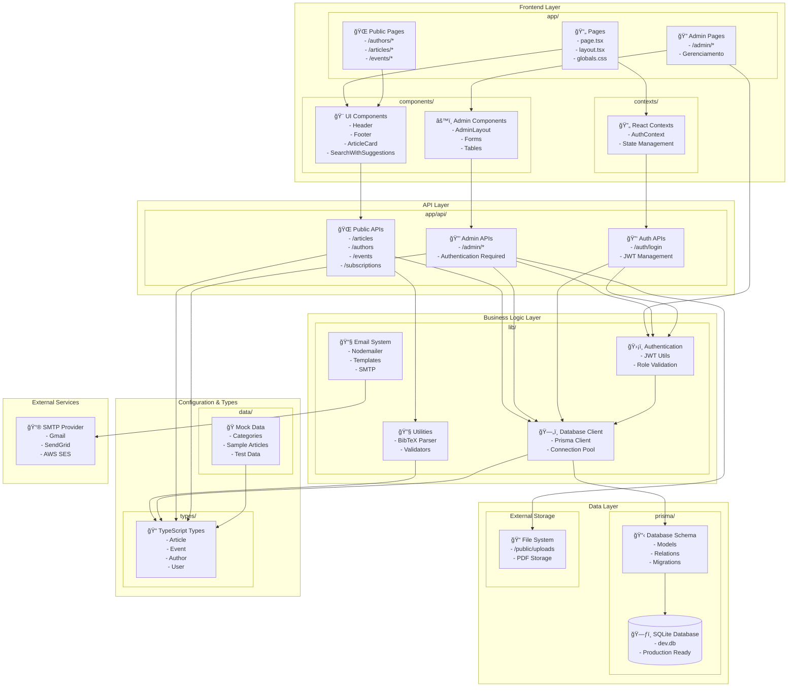

# Diagramas UML - Sistema Artigador

Este documento contém dois diagramas UML do sistema Artigador. Um diagrama de sequência e um diagrama de pacote

## Diagrama de Pacotes - Arquitetura do Sistema

Este diagrama mostra a organização dos principais pacotes e suas dependências no sistema.

## Diagrama de Sequência - Busca e Navegação de Artigos

Este diagrama mostra o fluxo de busca e navegação de artigos por usuários.

```mermaid
sequenceDiagram
    participant U as Usuário
    participant F as Frontend
    participant API as API Routes
    participant DB as Prisma/SQLite

    Note over U,DB: Fluxo de Busca de Artigos

    U->>F: Acessa /browse
    F->>API: GET /api/articles?page=1&limit=20
    
    API->>DB: SELECT articles com joins
    Note over API,DB: Include authors, categories, eventEdition<br/>Order by createdAt desc
    DB-->>API: Resultados paginados
    API-->>F: Lista de artigos + paginação
    
    F->>U: Exibe grid de artigos
    
    U->>F: Digite termo de busca
    F->>F: Debounce (300ms)  
    F->>API: GET /api/articles?q=termo&page=1
    
    API->>DB: Complex search query
    Note over API,DB: WHERE title CONTAINS termo<br/>OR abstract CONTAINS termo<br/>OR keywords CONTAINS termo<br/>OR author.name CONTAINS termo<br/>OR event.name CONTAINS termo
    DB-->>API: Resultados filtrados
    API-->>F: Artigos correspondentes
    
    F->>U: Atualiza lista em tempo real
    
    U->>F: Clica em artigo
    F->>API: GET /api/articles/[id] (não implementado)
    Note over API: Endpoint não existe,<br/>navega direto para /article/[id]
    F->>U: Navega para /article/[id]
    
    U->>F: Clica em autor
    F->>API: GET /api/authors/[id]?page=1&limit=10
    API->>DB: Busca autor + contagem
    API->>DB: Busca artigos do autor paginados
    Note over API,DB: ArticleAuthor join com Article<br/>Include authors, eventEdition, categories
    DB-->>API: Dados do autor + artigos + paginação
    API-->>F: Perfil completo com estatísticas
    F->>U: Navega para /authors/[id]
```

